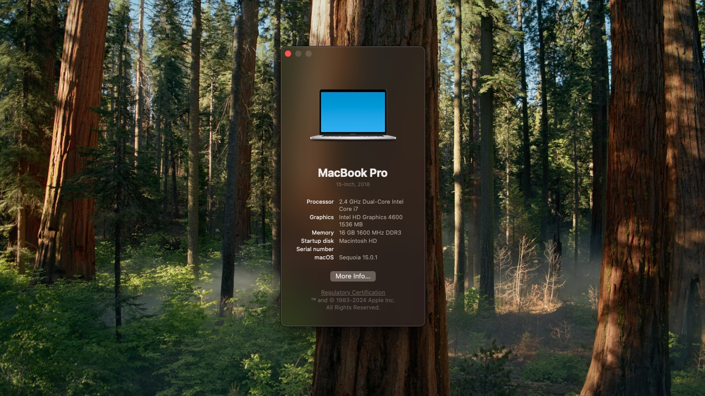

# Lenovo L540 MacOS Sequoia EFI

 <!-- Replace with the actual path to your screenshot -->

### Computer Specs 🖥️
| Component         | Details                          |
|-------------------|----------------------------------|
| **Laptop Model**   | Lenovo L540                     |
| **CPU**            | Intel Core i3 4000 Haswell      |
| **RAM**            | 16GB DDR3                       |
| **Storage**        | 256GB SSD                       |
| **Wireless**       | Intel                           |
| **Bluetooth**      | Intel                           |
| **Audio**          | Intel (needs compatible alcid)  |

### 🌟 What's Working:
| Feature                      | Status         |
|------------------------------|----------------|
| **Hardware Acceleration**     | ✅ Patched with [OCLP v2.0.2](https://github.com/dortania/OpenCore-Legacy-Patcher/releases) (Internet required) |
| **Sleep**                     | ✅ Working 💤 |
| **Bluetooth**                 | ✅ Working 🎧 |
| **Camera**                    | ✅ Working 📸 |
| **Microphone**                | ✅ Working 🎙️ |
| **Mini DP**                | ✅ Working 🖥️ |
| **USB Ports**                | ✅ Working  |
| **Audio**                     | ❓ Find [compatible alcid](https://dortania.github.io/OpenCore-Post-Install/universal/audio.html) |
| **Wireless**                  | ✅ Using itwlm + [Heliport](https://github.com/OpenIntelWireless/HeliPort) 🌐 |
| **Battery Management**        | ✅ Working 🔋 |
| **iServices** (iMessage, FaceTime, iCloud, App Store) | ✅ Working 💬 |

### ⚠️ What's Not Working:
| Feature                      | Status         | Notes               |
|------------------------------|----------------|---------------------|
| **Airdrop, Handoff, Continuity** | ❌ Not working | No compatible kext for Intel Sequoia. Waiting for **AirportItlwm** updates. |
  
> **Solution**: Using a compatible Broadcom card can fix Airdrop, Handoff, and Continuity issues. 🔧

---

### 🛠️ How to Use This EFI:
1. **Download** the EFI from [this repo](https://github.com/your-repo-link).
2. Use [SMBIOS Gen](https://github.com/corpnewt/GenSMBIOS) and [ProperTree](https://github.com/corpnewt/ProperTree) to create a new serial number for your device.
3. **Check** your serial number on the [Apple Coverage](https://checkcoverage.apple.com) website before saving to ensure it says "Invalid serial number."
4. Install **Heliport** immediately to gain Wi-Fi access.
5. Download and install **OCLP**, then **run it** and apply the root patches.
6. **Shutdown** the computer and turn it on again (do not reboot).

That’s it! If you encounter any issues, please [open an issue](https://github.com/your-repo-link/issues).

### 💪 Contributions Welcome
Read the [contribution guide](https://github.com/your-repo-link/contributing) and feel free to join in!
